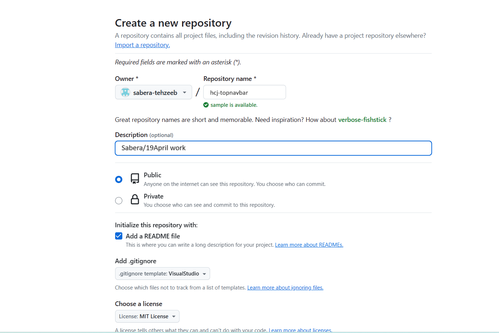
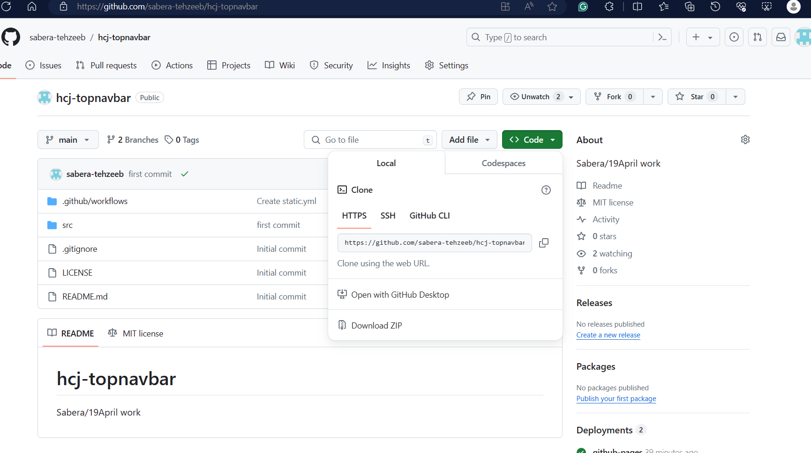
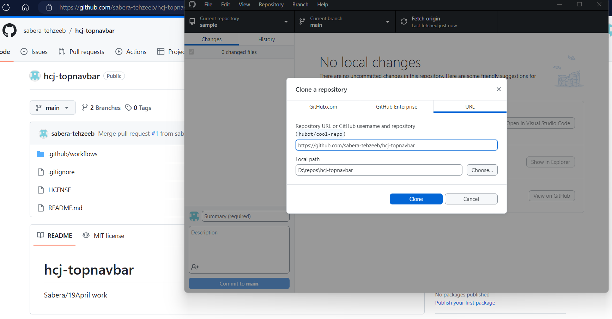
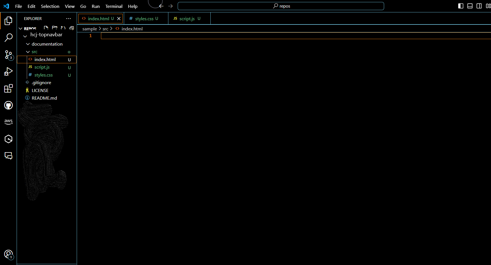

# Top Navigation Bar Using HTML, CSS and JavaScript

I am creating a Mini Project of Top Navbar using HTML, CSS, and JavaScript

## Section 1

#### Step-1: Create a Repository namely __"hcj-topnavbar".__

#### Step-2: Add Description.

#### Step-3: Select the __Public__ radio button.

#### Step-4: Select the checkbox __"Add a README file".__

#### Step-5: In gitignore dropdown select __"VisualStudio".__

#### Step-6: In License Option, Choose __"MIT Liscense".__

#### Step-7: Then click on __"Create Repository"__ button.

#### Step-8: Cloning the Repository into github Desktop.

#### Step-9: Opening in Visual Studio Code Editor.

#### Creating two folders namely

> 1. `documentation`-  For *Documentaion*
> 1. `src`- For *Source Code*

#### 1.  Documentaion Folder will contain **Images** Folder

#### 2. Source Folder will contain files namely:

 **a.** `index.html`

 **b.** `styles.css`

 **c.** `srcipt.js`

## Section 2
### Code in HTML
### Code in CSS
### Code in JavaScript
